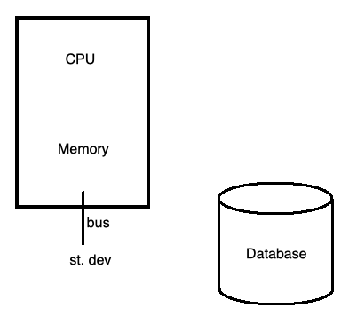

## COMP SCI 564: Database Management Systems: Design and Implementation

**Lecture-6**: September 18, 2019 <br/>

---

### **1\. What we have covered so far**:


---

### **2\. Interactions (Read Writes)**

  

<sup>*</sup>st. dev => standard devices

---

### **3\. Evolution over time:**

|    Capacity      | Capacity | Access Latency |   xf bw  |
| ---------------- |----------|----------------|----------|
| 30 years before  |   100MB  |       30ms     |   2MB/s  |
| today            |    20TB  |      5-10ms    | 200MB/s  |
| flash drives     |   512GB  |      0.1 ms    | 200+MB/s |

Some calculation => 10 e <sup>-3</sup> sec x 3 e <sup>9</sup> 1/sec = 30 e<sup>6</sup> </br>
<sup>*</sup> xf bw is transfer bandwidth

---

### **4\. More concepts ...**

```
    - Buffer pool
        o eviction by LRU (Least Recently Used)
        o clock = 2nd chance
        o other policies:
            - LFU (Least Frequently Used)
            - ARC (Adaptive Replacement Cache)
```


### **5 \. RAID (Redundant Array of Inexpensive Disks or Drives, or Redundant Array of Independent Disks)**

```
    - RAID-4
        o parity
        o what happens: 
                |-| ... |-|  |-|
                 1       N   N+1
        o small write penalty => large writes
        o N+1 used alot
        o since used alot, will tear out more frequently as compared to 1...N
    
    - RAID 5
        o rotating parity (b/w 1 to N)

    - RAID 6
        o N+2 , N+M redundancy
        o N disks 2 parity disks rotating, N disks m parity disks rotating 
```         

<sup>*</sup> |-| is a disk

---

### **6\. More concepts ...**

 

---

### **7\. Types of search in memory**:

```
    - Sequential search
        o Time complexity: O(N)
    - Binary Search
        o Need sorted data
        o Time complexity: O(logN)
    - Interpolation Search
        o sorted & uniform distribution
        o Time complexity: O(loglogN)
```

```
    - Binary search has very predictable repeatable performance [Robust Performance]
    - Interpolations search is good sometimes and sometimes not [Performance]
    - Performance and Robust Performance
    - It is good to have robust performance (predictable repetable performance) than only performance

    Free h/w:
    - Find students who has taken all database courses, print student id of all such students.
```

---

### **8\. Homework quetion**:

```
Q. For each department (name & id), how many students take courses (distince names) ?
```


**Create Query**: 
```
Create table enrollment (id integer, dept varchar(20), no integer, grade integer) foreign key (id) references student, foreign key (dept, no) reference course primary key (id, dept, no)
```

**Select Query - 1**: 
```
Select d.id, d.name, (select count(distinct s.name) from student as s join enr as e using (id) where d.id=e.dept) as student.count from dept as d
```

**Select Query - 2**: 

```
Select count(*) from (select distinct s.name from student as s join enr as e using (id))
```

**Visulaizing these queries:**

```
Student Table:              Enrollment Table:                       Result of Select Query:

|  ID  | Name |             |  ID  |  Dept |  No | Grade |           |  ID  | Name |  ID  |  Dept |  No | Grade |           
| ---- | ---- |             | ---- | ----- | --- | ----- |           | ---- | ---- | ---- | ----- | --- | ----- |
| 123  | Bob  |             | 123  |  CS   | 302 |   F   |           |  123 | Bob  | 123  |   CS  | 302 |   F   |--|     
| 456  | Mike |             | 456  | Music | 113 |   A   |           |  123 | Bob  | 456  | Music | 113 |   A   |--|---> Inner Join & Right Outer
| 789  | Jill |             | 454  |  Bio  | 101 |   B   |           |  456 | Mike | 454  |  Bio  | 101 |   B   |--|
                                                                     |  789 | Jill | Null | Null  | Null|  Null |------> Left Outer & Full Outer

``` 
