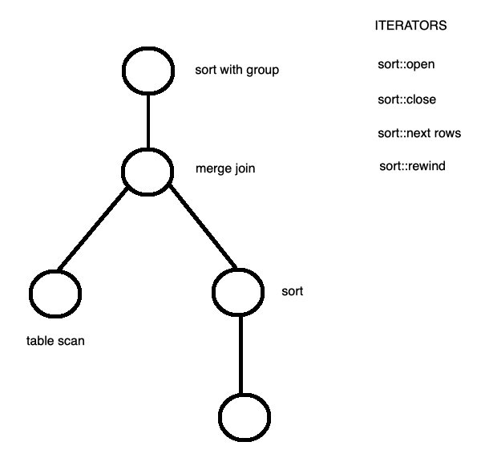

## COMP SCI 564: Database Management Systems: Design and Implementation

**Lecture-11**: October 2, 2019 <br/>

---

### **1\. Query execution algorithms (Cont ...)**

```
- File size large, it (input rows/ hash table) does not fit in memory => distributed sort

- GROUP BY algorithm and DISTINCT algorithm are very similar 
```

---

```
REVISION of last class:
    - 3 algos for duplicate removal:
        o in-stream: requires sorted input, scan over sorted inout, whenever encouter duplicate, remove duplicated
        o in-sort: during sorting, whenever we encounter duplicate during comparision, we remove them 
        o hash: check if key (row) exists, we remove duplicates
                : condition: should fit in memory (output size of hash table should be less than of equal to memory)
```

### **2. Set operations**

```
- Intesection:
    o exists in two cases:
        - when specified INTERSECT in query itself
        - or query is of sort: SELECT ... FROM ... WHERE cond-1 AND cond-2
    o how to do intersection? (algorithm)
        - sort
        - merge join
        - join algorithsm
    o practically, intersect and join algorithms are same
```

### **2. Example**


|      |       JOIN       |  Set Operation |
| ---- |------------------|----------------|
|  B   |   inner join     |  intersection  |
|  A   |  left semi join  |   difference   |
|  C   | right semi join  |   difference   |
| AB   | left outer join  |                |
| BC   | right outer join |                |

### **3. Functions:** 

```
- Open, Close
- Next, Read
- Rewind

NOTE: Every operator require these functions

```



### **4. EXCHANGE operator**


```
NOTE:
    - results of each thread (thread-1, thread-2) are partitioned by exchange operator
    - o => in diagram => operator from above diagram
```

---

