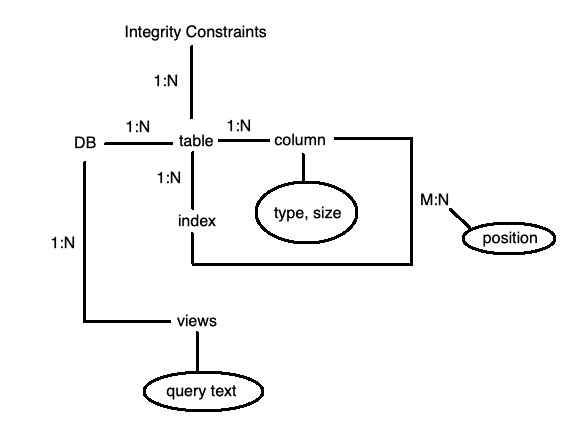
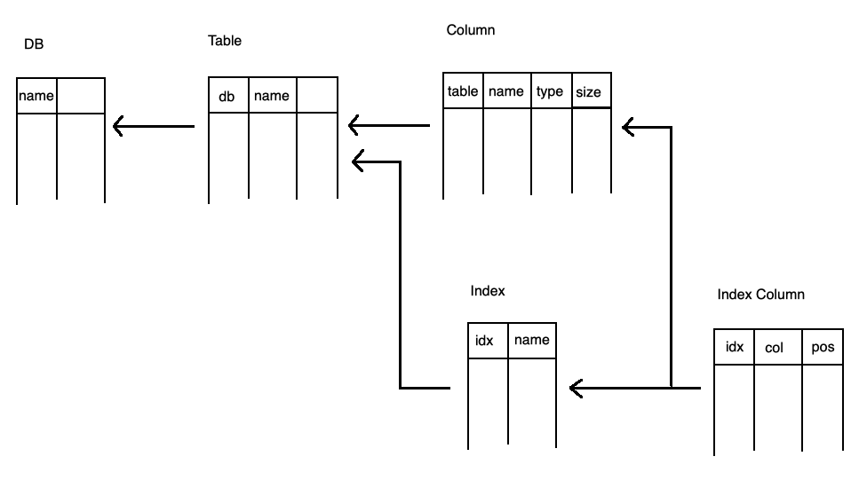

## COMP SCI 564: Database Management Systems: Design and Implementation

**Lecture-12**: October 7, 2019 <br/>

---

### **1\. Questions in Piazza** 

```
Q.1. What is a relation?
Ans. A table.

relation => In mathematics
    -> cannot have duplicates
table => In computer science
    -> can have duplicate rows

Q.2. What is query execution plan?
Ans. Query execution/evaluation plan = tree/dag (directed acyclic graph) of operators
     e.g. operator = algo(e.g. sort, merge join) as iterator


            |
        merge join
            |
           / \
          /   \
        sort  b-tree scan
         |
        h g
        / \
       /   ...
     scan

Q.3. Aggregation grouping
Ans. in-stream:             requires sorted input                                                                                                  
     in-sort:               ---------------------------------->>>>  1 of (not so good) groupyby algorithm:     o                                     *
     hash-aggregation                                                                                         -|-  <---  instream aggregation <-- sort <-- scan
                                                                                                              / \
                                                                                                              user
* => within this sort, we remove the duplicates (i.e. in-sort)

Q.4. Is in-sort better than in-stream?
Ans. We cannot say that. If data is already sorted, in-stream will play its role. (i.e. it will remove the duplicates)
     If data is unsorted, in-sort will remove the duplicates while performing sorting.


```

### **2\. Metadata**

```
It means data about data.
In compilers, we study about symbol table. (which stores information about all operators, etc. i.e. metadata). 
It is required for compiling. Once, machine executable code has been generated, we do not need symbol table.

Database ~= schema
   |
   |--> tables, integrity constraints
   |--> columns, types  
   |--> vies (= stored query text)
   |--> indexes

```

### **3\. Sample metadata entity relationship diagram**



### **4\. Sample metadata tables**



### **5\. Statistics in databases**

```
1. Histograms

    ^
    |        __
    |       |  |
    |    _ _|  |
    |   | | |  |
    |  _| | |  |
    | | | | |  |
    |-------------------> yob
      1992  94  96  98 

* yob ==> year_of_birth

equi-width                 -- counters                                              -- 1 scan required to compute (O(n))        -- easy to implement
equi-height (x --> area √) -- quantiles (scale to 1, percentage scale to 100)       -- vaguely equivalent to sort (O(nlogn))    -- slighly complicated
max-diff                   -- key values + counters                                 -- more costlier                            -- fairly complicated

NOTE:
- we merge histograms, which have equal values
- we keep hostograms, which have different values

* here histograms are compared to the ones which are next to each other 
```

---
