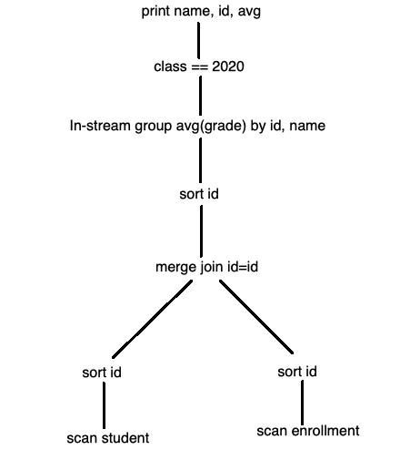
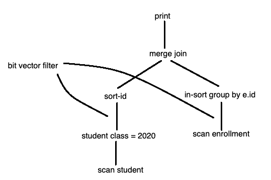

## COMP SCI 564: Database Management Systems: Design and Implementation

**Lecture-13**: October 9, 2019 <br/>

---

### **1\.[RECAP]** 

Where we are:
```
- SQL parser
- query optimization eg. join sequence
- query execution eg. merge join
- utilities eg. sorting
- storage structures eg. b-tree
- storage devices
```

We will discuss more on below items after mid-term:
```
- To share structured data, we need: 
    - schema
    - transactions, concurrency control, reliability
```

---

### **2\. Execution Plans**

```
Execution Plan Option-1:

SELECT s.name, s.id, avg(grade)
FROM STUDENT as s, ENROLLMENT as e
WHERE s.class = 2020 on AND s.id = e.id
GROUPBY s.id, s.name
```



```
Possible optinizations:
    - redundant sort
    - hash join
    - index e.id
        o inline join
    - eliminate sort for merge join
```



---

### **3\. What does query optimizer get to do?**

```
        |--> row count
   |---------|
1. Cardinality estimation ---|--> histogram
                             |--> multiply for conjunction
                             |--> magic numbers: "="  => 10% 
                             |                   "<"  => 45%
                             |                   "<=" => 55%
                             |--> independence assumption
                             |--> sampling


Discussion: Merge join vs hash join 
    group join: duplicate removal / group on build input
```


---
