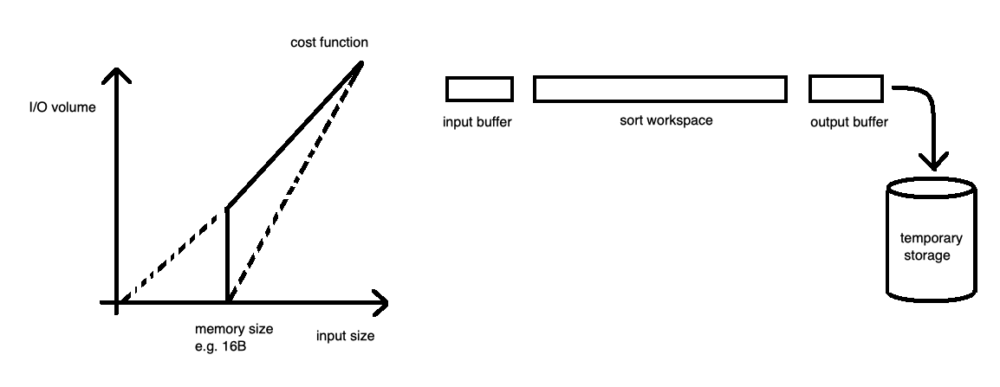
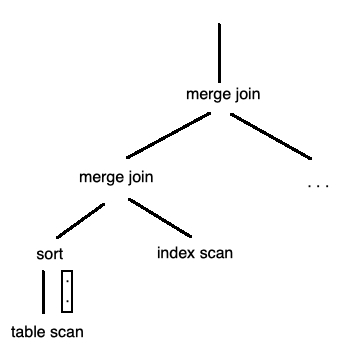
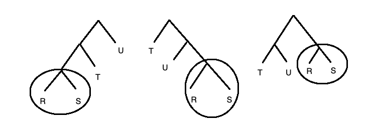

## COMP SCI 564: Database Management Systems: Design and Implementation

**Lecture-15**: October 14, 2019 <br/>

**Topic**: Query Optimization

---

### **1\. [RECAP] Execution Plan**



---

### **2\. [QUESTIONS] Is SQL a compiled or interpreted language?**

```
Ans. It might be worse than that. 

Till now, we discussed about the following:

                     |<-- SQL Paarser                                           --| database cataglog
Abstract Syntax Tree |--> Compiler Optimization --|                             --|     = schema
                          Query Execution      <--| Query Execution Plan
                          Storage Structure
                          Storage Devices
```



---

### **3\. [QUESTIONS] Errors (compilation, runtime, etc.)**

```
1. where = < > [ ]
2. from student where wheels = 4
3. where x.a = (select * from ...)
```

---
---

### **4\. [TOPIC] Query Optimization**

```
    - IBM System R (published in 1971)
    - machine code
    - chached and shared
    - push select and project "down" to scans
    - compare 10 join algorithm ---- only 2 matters: Merge Join, Index Nested Loop Join, Nested Loop Join       (Did not include Hash Join)
                                                        |           |        
                                (requires equality predicate)       (requires index on join predicate)
    - hash join published by 3 different groups together in 1984 
    - join sequence by dynamic programming
```

```
Question. What is index nested loop join?

Ans. 
Nexted Loop Join: 
    R x S: 
        for r in R:
            for s in S:
                if r x s => output
Index Nested Loop Join:
     R x S: 
        for r in R:
            search in index on S:
            for s in index result:
                output  
```


```
Cont ...

    - join sequence by dynamic programming
      
      for n=1 to #tables:
        for all subsets of n tables:
            if the subset is connected then
                for all subsets S1 of S, S1 != 0, S1 != S
                    S2 = S \ S1
                    plan join of S1 and S2 using cached plan of S1 and S2
                    (store the plan for further use of this plan later i.e. save the partial solution (candidate plan))
    - for e.g. 
        S = {R, S}
        S1 = {R}
        S2 = {S}
        plan join of S1 and S2
```



---
