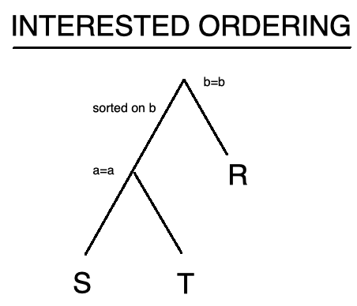
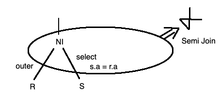

## COMP SCI 564: Database Management Systems: Design and Implementation

**Lecture-16**: October 16, 2019 <br/>

**Topic**: Query Optimization

---

### **1\. [RECAP] Query Optimization**

```
1) dynamic programming: save the partial solution (i.e. candidate plan)
2) "sargable predicate": scan/search argument a=5 AND b<9
3) interesting ordering: t.a = s.a AND s.b = r.b
```



---

### **2\. Ingres Query Optimization**

```
    - From UC Berkely
    - One Variable Query Processor (OVQP)
        o here, one variable is table alias
        o scan, select, project, in-stream aggregation
        o including single index
    - One variable substitution 
        Run OVQP for r
        for each value r.b, say 3
            rewrite the query, say t.a = s.a and s.b = 3
    - Bob Kooi from Case Western University
        o implemented compile time planning
        o Cardinality Estimation with integrity constraints & histograms
        o modelled the relationship between secondary and primary indexes for additional joins
    - UC Berkely hired Bob Kooi
```

---

### **3\. Extensible Database Systems**

```
    - EXODUS Transform (relational) algebra
        o R join S = S join R
        o R join (S join T) = (R join S) join T
        o a variant of this made it to Microsoft SQL Server
    - Starbust project (from IBM)
        o rule based expansion                  |--> fetch(same table, all remaining columns)
            - table-access(predicate) --> index-access(predicate)
        o eventually made it to IBM's DB2 product
    - Oracle
        o rule based query planner
        o syntax driven
```

### **4\. Optimizing Nested Queries**

```
    - Nasty thing (not easy)
    - e.g. from R
           where exists (Select * 
                        From S
                        Where s.a = r.a)
```
     


---
