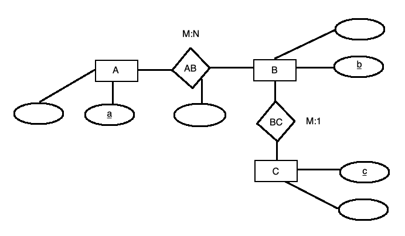
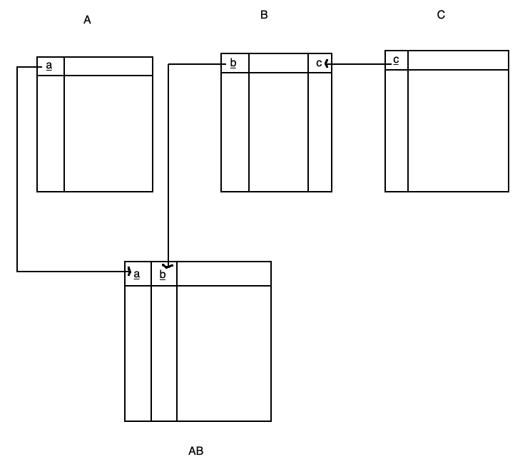
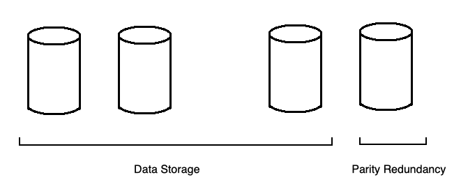

## COMP SCI 564: Database Management Systems: Design and Implementation

**Lecture-18**: October 21, 2019 <br/>

**Topic**: Mid Term RECAP

**Exam time**: Friday to Friday

---

### **1\. RECAP for Mid Term**

```
>> ER & DB Design:
        - from m,n to table design
            o for M:1, we add primary of C as forign key in B
            o for M:N, we create a new table with composite primary as a and b, which are also forign keys
        - RAID (Redundant Array of Inexpensive Disks)
            o RAID 4: 7 + 1 disks
            o RAID 5: 8 disks => 1/8 data + 1/8 parity
            o RAID 6: 9 disks => 7/9 data + 2/9 parity
```


 <br/><br/><br/><br/>


```
>> Queries:
        - Having
            o selection queries
            join
            group by 'avg'
            having "where on o/p of grouping"

            o eg. SELECT s.id, avg(e.grade), min(e.term)
                FROM student as s, enrollment as e
                WHERE s.id = e.id and s.home_city = "Madison"
                GROUP BY s.id
                HAVING min(e.grade) = 4.0

            o another alternative eg. WITH ___ as (SELECT ...)
                                    SELECT * FROM ___
                                    WHERE a in (SELECT min(a) FROM ...) 

```

```
>> Indexes and Sort
        - Tree of Losers
```

```
>> Query Execution
        - Examples
        - Nested Loop Join vs Index Nested Loop Join
            o Nested Loop Join
                - eg. for each row r in table R:
                        for each row s in table S:
                            if r & s match
                                then output r join s
                - Q. how many times this is executed?
                Ans. Cardinality of R vs Cardinality of S
            o Index Nested Loop Join
                - index lookup on table S
        - Aggregation: in-stream, in-sort, hash-aggregation
            o in-stream: simplest algorithm, but requires sorted input
            o in-sort: "collapse" rows within the sort already
            o hash-aggregation: country total count
                                ________________
                                |    |    |    |
                                |--------------|
                                | PE |    |    |
                                |--------------|
                                | BE |    |    |
                                |--------------|
                                |____|____|____|  
        - ems & cliffs & gracefull degradation 
            o just bcoz of 1 bad country with one records, we change our execution plan (aggregation algorithm)
            o that is a cliff
```

```
>> Query Optimization
        - Examples
        - core concepts
        - output format
        - star join
```

---
