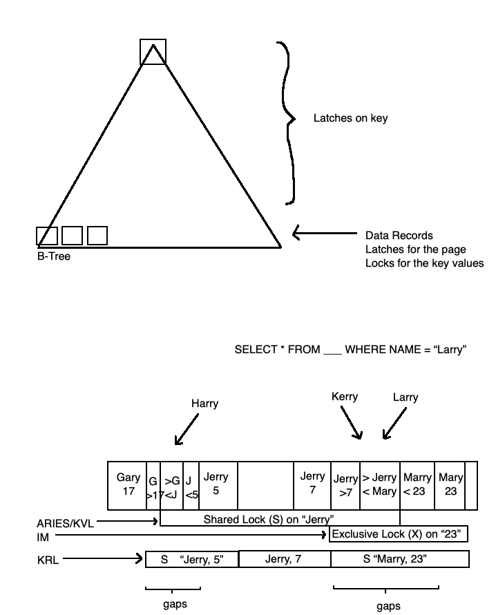

## COMP SCI 564: Database Management Systems: Design and Implementation

**Lecture-22**: November 4, 2019 <br/>

**Topic**: Concurrency Control

---

### **1\. RECAP**

```
LSN: Log Sequence Number: byte address within log
    - a concept within WAL (write ahead logging)

Redo, Undo, Rollback, Rollforward

Types of failures:
    - transaction failure
        o recovery: transaction rollback:
            -log records from linked list 
                o Q. how does the LL work? 
                  Ans. pointers as LSN
            - "update back" with logging
                o  NOTE: before the failure occurred, the transactions were in progress
                   which means there were updates in records and hence, page addresses (in B-Tree) might have changed just before crash
                   "Update Back" has to take that also into account
    - system failure
        o system restart
            - log analysis: 
                o gather (1) from below
                o what all do we need from log analysis? (1)
                    - transaction manager + LSN
                    - buffer pool + dirty pages + LSN
            - redo: 
                o Purpose of redo is to get all the pages right before the crash
                o Just apply all the changes
                o TIP: each page header contains Page LSN 
            - undo: 
                o Purpose of undo is to rollback loser transactions
    - media failure
```

### **2\. ISOLATION**

```
Atomicity: failure atomicity: all or nothing
C
ISOLATION: also sometimes called "concurrency control, synchronous atomicity": single-user semantics, equivalent to serial execution
D
```

```
|---------------------------------------------------------------------------------------|
| Transactions                        |           Threads                               |
|---------------------------------------------------------------------------------------|
| - database contents                 |           - in-memory data structures           |
| - locks                             |           - latches                             |
|     o deadlock detection (DD)       |               o deadlock avoidance (DA)         |
|     o deadlock resolution           |                                                 |
| - active transactions               |           - critical sections                   |
|     o secs, mili secs, hrs          |               o < 1 micro secs                  |
| - Shared Lock (S),                  |           - Read Write                          |
|   Exclusive Lock (X),               |                                                 |
|   Update (U),                       |                                                 |
|   Intention                         |                                                 |
| - DD:                               |           - DA:                                 |
|     o wait for graph                |               o Programming Discipline          |
|     o lock wait time-out            |               o Lock levelling                  |
|     o limited wait depth            |                                                 |
|     o LOCK MANAGER                  |                                                 |
|---------------------------------------------------------------------------------------|
```

### **3\. What actually gets locked?**



```
Shared Lock => When Read
Exclusive Lock => When Write
```

```
KVL => Key Value Lock
IM  => Index Management
KRL => Key Range Lock (required for queries having BETWEEN)
```

---