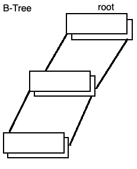

## COMP SCI 564: Database Management Systems: Design and Implementation

**Lecture-23**: November 6, 2019 <br/>

**Topic**: Concurrency Control

---

### **1\. RECAP**

```
Lock Modes: S (Shared), X (Exclusive)
            |           |--> write only
            |--> read-only

Lock Sizes: Database, Table, Index, Page, ...   |--> IBM ARIES/KVL: distinct key-value + gap to prior key-value
            within B-Tree index ----------------|--> IBM AIRES/IM:  logical row (in all indexes) + gap to prior lock row (in all indexes)
                                                |--> DEC KRL:       index entry (one row, one index) + gap to prior index entry
                                                     (Digital Equipment Co-orporation)
                                                     .
                                                     .
                                                     .
```

### **2\. Multi-version storage:**

```
- files, db pages, index entries
         |          |--> version id as key suffix r.g. LSN
         |--> copy-on-write b-tree
```


### **3\. Snapshot Isolation:**
```
++ read-only  transactions (++ => works good)
~~ read-write transactions (~~ => does not work good)

e.g. why reaf-write does not work good with snapshot isolation?

|----------------------------------------|
| Time | Event                           |
|------|---------------------------------|
|  01  | start T1                        |
|  02  | start T2                        |
|  03  | T1 reads A=11 as of time 1      |
|  04  | T2 reads A=11 as of time 2      |
|  05  | T2 calculates A = A + 2 = 13    |
|  06  | T2 writes A = 13 with X lock    | (Conflict in Pessimistic Concurrency Control) : remedy - often can resolve by waiting or abort
|  07  | T2 commits & releases all locks |
|  08  | T1 calculates A = A + 1 = 12    |
|  09  | T1 writes A = 12 with X lock    |
|  10  | T1 commits & releases all locks | (Conflict in Optimistic Concurrency Control) : remedy - T1 do over
|  11  | T3 starts                       |
|  12  | T3 reads A = 12 ≠ 14            |
|----------------------------------------|

Snapshot Isolcation for read-write transactions: deffered lock acquisition 
```

### **4\. Optimistic Concurrency Control**
```
Optimistic Concurrency Control: end of transaction validation (1) track read-set & write-set (transaction-private buffer with updates)
(locking is too pessimistic!)                                  |
                                                               |     |    read phase    |  validate write  |
                                                               |     |------------------|------------------|
                                                               |     |  write--|        | buffer--|        |
                                                               |               |                  |
                                                               |             buffer              DB
                                                               |
                                                              (2) timestamps
NOTE: Pessimistic Concurrenccy Control provide more options to remedy

   --> SV PCC
++ --> MV OCC
       ^   ^
       |   |
      ++
```             

---