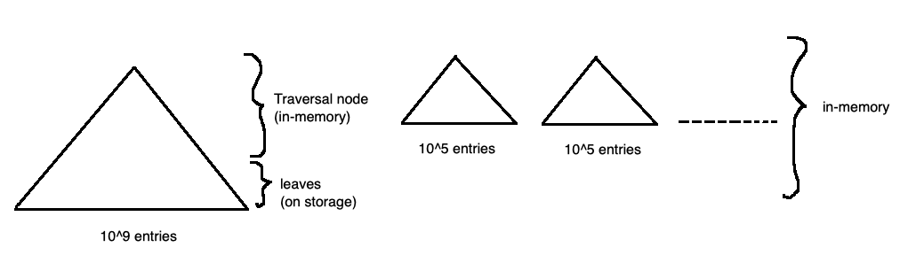
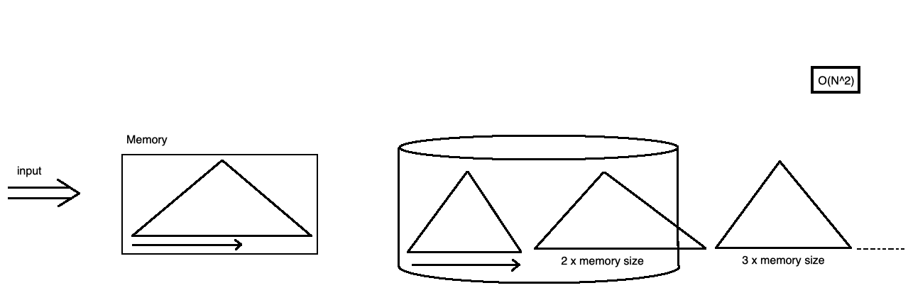

## COMP SCI 564: Database Management Systems: Design and Implementation

**Lecture-26**: November 15, 2019 <br/>

**Topic**: Key Value Stores

---

### **1\. RECAP**

```
Q.1. How to make vertica slower?
Ans. Select * ...

- Column Stores (e.g. Vertica): ROS (Read Optimized Store) & WOS (Write Optimized Store)
    o ROS: columns, on storage devices (disk arrays), compressed
    o WOS: rows, in-memory, lightly compressed
- Comments:
    o WOS good as in-memory, but limits size. Hence, we need sync processes to off-load data to ROS (storage devices)

Traditional Database: B-tree indexes
    - 10^9 rows stored
    - 10^5 rows loaded
    - It will take lot of time as compared to Column Stores

How to make Traditional Database faster?
    - Idea1
    - Idea2: External Merge Sort: Run generation by read-sort-write cycles (e.g. quicksort)
                                  or by replacement selection (using priority queues)
             Con: O(N^2) (bcoz: the entry which came first is again read and copied, when memory size is filled)
    - Idea3: Merge two large trees: O(NlogN)
    - Idea4: Log Structure Merge-trees (LSM-forest)

How to search entry 74 which exist in lasrge tree?
    - Create a bit-vector for entries in each b-tree.
    - If present in bit-vector, then only search in b-tree, else check bit-vector onother b-tree. (until found)
```



---