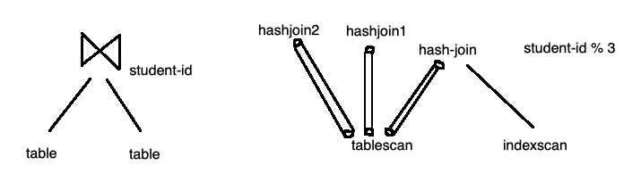

## COMP SCI 564: Database Management Systems: Design and Implementation

**Lecture-27**: November 18, 2019 <br/>

**Topic**: Parallel Processing

---

### **1\. Query processing**

```
- Parallel processing in SQL
    o partitioning set (of rows) - skew, load imbalance (possible solution: hash partitioning)
    o pipelining
```



---

### **2\. Transaction processing**

```
- parallel processing in transaction processing
    o fine granularity of concurrency control (e.g. locking)
    o multiple (write-ahead) logs
    o cluster of nodes (node = OS instance)
        - local lock manager
        - local record log
```
```
clusters: capacity (data generation, transactions),
          reliability, availability, redundancy

          mirroring vs log shipping
 (write all places)    (recepients catchup recovery)
  e.g. file systems     e.g. database systems
```

---
