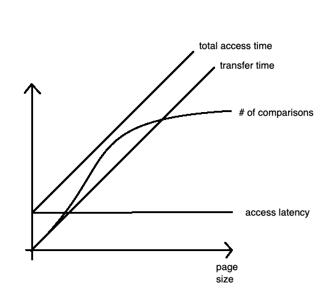

## COMP SCI 564: Database Management Systems: Design and Implementation

**Lecture-29**: November 25, 2019 <br/>

**Topic**: In-memory Database

---

### **1\. In-memory Database**

```
Advantages:
    - performance:
        o raw speed
        o robust, perdictable, repeatable performance
    - simple, less code
    - persistent storage
        o online, write-back
        o backup

Disadvantages:
    - capacity and limit
    - cost $$
    - volatile storage
```

### **2\. What can we do to traditional "in-memory database" to make it provide "raw speed"?**

```
    - compression
    - indexes
    - data-structures optimized for CPU
    - compilation to machine code
        o b-tree comparison
        o scan predicates
        o hash functions
```

### **3\. B-tree page/node size**

```
    - 1 option: OS/VM page
    - max page size     # of comparisons / (access latency + transfer time (size/bandwidth))
    - page size = access latency * transfer bandwidth   e.g. 10 ms x 100 MB/s = 1000 KB
```



### **4\. What to keep in-memory database? How big this memory should be?**

```
    - five minute rule (Jim Gray, G. F. Putzolu)
        - memory space/capacity
        - (if not memory space/capacity, then) access capacity
                1 disk * 15 ms = $ 0.01 (cost to own disk for 15 ms, here 15ms is access frequency)
        - page/record size: 1 KB e.g. cost = $0.0001 (cost of capacity)
        - result: five-minute rule
```

### **5\. What not to keep in in-memory database?**

```                                       
                                                                   buffer pool
                                                                |---------------------|    1. hash(page number)
                                                                |                     |    2. latch acquisition
                                           pointer swizzling    | |----|     |----|   |    3. search in hash table (table of content of buffer pool)
    - bufferpool LRU, ..., repl algo       page no.             | |    |---->|    |   |       (including linked list)
                                             |                  | |----|     |----|   |    4. latch release
                                             V                  |  page number        |
                                           VM address           |---------------------|
```

---
