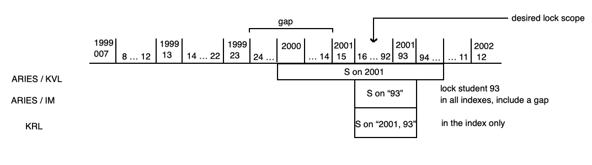
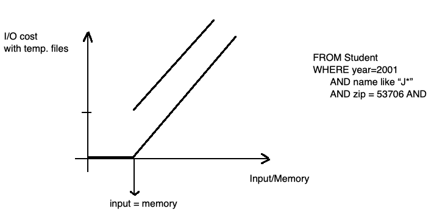
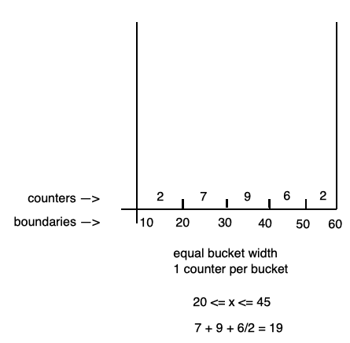
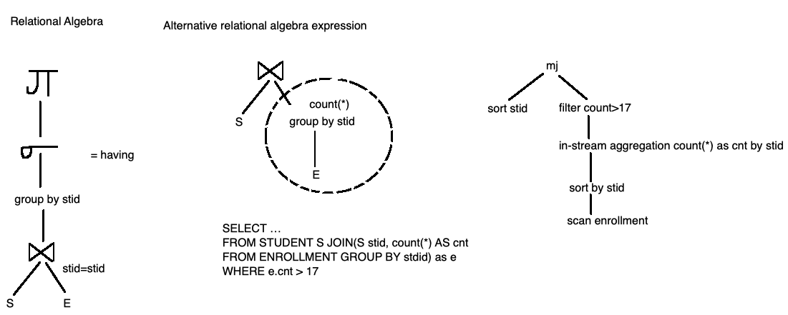

## COMP SCI 564: Database Management Systems: Design and Implementation

**Lecture-30**: November 27, 2019 <br/>

**Topic**: RECAP before Thanksgiving

---

### **1\. JOINS**


---

### **2\. Concurrency Control: Locks**



---

### **2\. Robust Query Performance**

```
~ graceful degradation
≠ performance cliff
```



---

### **3\. Cardinality Estimation**

```
Comparison Operator: "=" => 10%
                     "<" => 45%
                    "!=" => 90%                         P1      or      P2
Logical Operator:  "and" => product                     20%             10%
                    "or" => sum - product               0.2 + 0.1 - 0.2 * 0.1 = 0.28
```



---

### **4\. Query Optimization**

```
SQL query to find out student registered in more than 17 courses

SELECT st.stid, st.name
FROM Student as st join enrollment as e on (st.stid = e.stid)
GROUP BY st.stid, st.name
HAVING count(*) > 17
```

---
